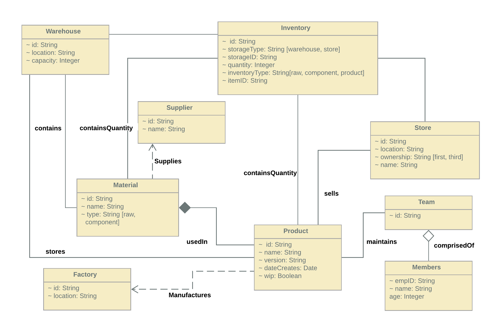

# paypalBAT
Product Manegement REST API

# Description
The product mangement system is made for a startup named Brainwave Assistive Technologies. The startup builds neurotechnology devices with the help of Brain Computer Interfaces. The product mangement system is meant for the employees of the company to help with supply chain management and logistics.

**Swagger API Link**

[BAT v1](https://app.swaggerhub.com/apis/shreyanshVIT/BAT/1.0.0)

**Github Documentation**

[Documentation Link](https://github.com/shreyanshsaha/paypalBAT)

# Class Diagram

The following class diagram describes the relations between the entities used in the API.

## Entities
1. Product

|Attributes|Description|
|----------|-----------|
|ID|ID of the product|
|Name|Name of the product|
|Version|Version of the product|
|DateCreated|Date on which the product was created|
|wip| Work in progress|

2. Supplier

|Attributes|Description|
|----------|-----------|
|ID|ID of the supplier|
|name|Name of the supplier|

3. Material

|Attributes|Description|
|----------|-----------|
|ID|ID of the material|
|Name|Name of the material|
|type|Type of the material: (raw, component)|

4. Team

|Attributes|Description|
|----------|-----------|
|ID|Id of team|

5. Members

|Attributes|Description|
|----------|-----------|
|empID|ID of the member|
|Name|Name of the member|
|Age|Age of the member|

6. Warehouse

|Attributes|Description|
|----------|-----------|
|ID|ID of the warehouse|
|Location|Location of the warehouse|
|Capacity|Capacity of the warehouse|

7. Factory 

|Attributes|Description|
|----------|-----------|
|ID|ID of the factory|
|Location|Location of the factory|

8. Inventory

|Attributes|Description|
|----------|-----------|
|ID|ID of the inventory item|
|storageType|Type of storage the item is stored in: (warehouse, store)|
|StorageID|ID of the storage|
|Quantity| Amount of items stored|
|InventoryType|Type of item: (raw, component, product)|
|ItemID| ID of the item stored|

9. Store

|Attributes|Description|
|----------|-----------|
|ID|ID of the store|
|location|Location of the store|
|Ownership|Type of ownership: (1st Party, 3rd Party)|
|Name|Name of store if third party|

# Components used in Swagger
  - Schemas
  - Parameters
  - Error
  - Security Schemas

# Error Codes used in Swagegr
  - 200
  - 400
  - 401
  - 404
